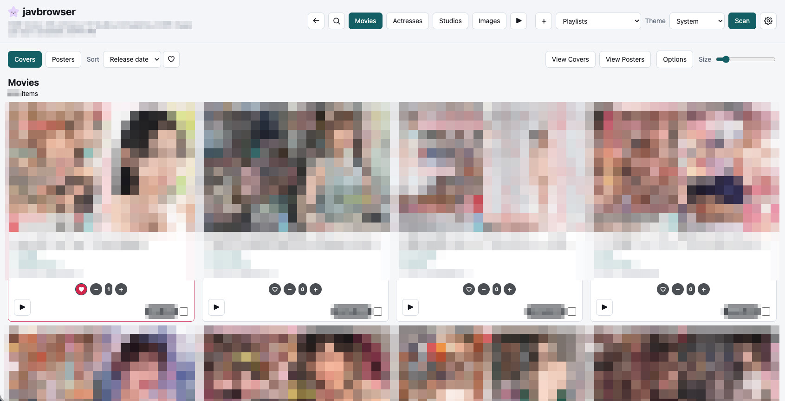

# javbrowser

javbrowser is a simple browser and playlist-maker for your JAV library. It is designed to sit nicely beside [javinizer/javinizer-go](https://github.com/javinizer/javinizer-go): let Javinizer organize folders, NFO files, posters, and covers, then use javbrowser as a fast local wall browser for actually looking through the library.

It is also a simpler alternative to [stashapp/stash](https://github.com/stashapp/stash). Stash is much more powerful and much more general. javbrowser is intentionally narrower: scan local folders, show covers and posters well, group by actress or studio, keep favorites and counters, and make playlists without turning library browsing into a larger media-server project.

I made it because I wanted a smaller browser that displayed my covers better and could make playlists from the exact order I was browsing in. That is the whole center of gravity here.



## Disclaimer

This project is completely vibe-coded using Codex. I use it personally, it works well for my workflow, and it is intentionally practical rather than architecturally precious. Expect a local-first hobby app, not a hardened multi-user server.

## Features

- Browse by covers, posters, actresses, studios, or unmatched videos.
- Sort movies by actress, counter, file size, random order, release date, or title.
- Sort actresses and studios by name, movie count, random order, or favorite status.
- Open a full-screen cover or poster viewer from the current sorted list.
- Play one movie, a person/studio group, the visible sorted list, or a saved playlist.
- Native mode can launch videos and playlists in your default desktop app.
- Create playlists from checked movies, actresses, studios, or the current browsing order.
- Add checked items to the currently selected playlist.
- Save, rename, favorite, delete, play, and download playlists.
- Favorites for movies, actresses, studios, and playlists.
- Per-movie counter, similar in spirit to Stash counters.
- Light, dark, and system theme modes.
- Adjustable cover, poster, person-card, and lightbox sizing.
- Image-wall mode for denser browsing.
- Hide missing images.
- Optional movie ID labels in image-wall mode.
- Drag and drop actress images onto actress cards.
- Drag and drop studio images onto studio cards.
- "Other Videos" area for videos with no poster or cover artwork.
- Automatic screenshot cover generation for other videos when `ffmpeg` is available.
- Stores scan results, preferences, favorites, counters, playlists, and custom artwork in SQLite/config storage.
- Docker support for a portable containerized run.

## Recommended Setup

Native mode is recommended if you want play buttons to open files directly in your desktop video player. Docker is useful if you want a tidy container, but browser/container security limits direct host-app launching.

javbrowser expects:

- Node.js 22 or newer.
- A local media folder.
- A writable config folder.
- Optional but recommended: `ffmpeg` and `ffprobe` on PATH for generated covers and video duration.

## Folder Structure

javbrowser scans every supported video file under `MEDIA_ROOT`, recursively. The folder tree does **not** have to be `Actress > Movie` as long as useful NFO files are present.

Supported video extensions:

```text
.mp4
.mkv
.wmv
.mov
.avi
.m4v
.webm
```

### Best Structure

This shape works especially well with Javinizer-style libraries:

```text
/path/to/media/
  Actress Name/
    ABC-123 [Studio Name] Movie Title/
      ABC-123.mp4
      ABC-123.nfo
      ABC-123-poster.jpg
      ABC-123-fanart.jpg
```

With this layout, javbrowser can infer a fallback actress from the top-level folder and may find actress images from `folder.jpg`, `folder.png`, `folder.jpeg`, or `folder.webp` in the actress folder.

### Movie Folders Also Work

This works well when each movie folder has an NFO:

```text
/path/to/media/
  Movie A/
    movie-a.mp4
    movie-a.nfo
    poster.jpg
    cover.jpg
  Movie B/
    movie-b.mkv
    movie-b.nfo
    poster.jpg
    fanart.jpg
```

### Flat Folders Can Work

This can work too:

```text
/path/to/media/
  movie-a.mp4
  movie-a.nfo
  movie-a-poster.jpg
  movie-a-cover.jpg
  movie-b.mkv
  movie-b.nfo
  movie-b-poster.jpg
  movie-b-cover.jpg
```

Flat folders rely more heavily on NFO data. Without NFO actor names, javbrowser has little to group by for actresses.

## NFO Metadata

NFO files are important but not absolutely required.

javbrowser looks for one `.nfo` file in the same folder as the video. When present, NFO metadata wins over folder inference.

Movie IDs are read from the first available tag:

```xml
<id>ABC-123</id>
<uniqueid>ABC-123</uniqueid>
<num>ABC-123</num>
<code>ABC-123</code>
```

Titles come from:

```xml
<title>Movie Title</title>
```

Studios come from:

```xml
<studio>Studio Name</studio>
<maker>Studio Name</maker>
<label>Studio Name</label>
```

Actresses come from repeated actor blocks:

```xml
<actor>
  <name>Actress Name</name>
</actor>
```

Dates come from:

```xml
<premiered>2024-01-01</premiered>
<releasedate>2024-01-01</releasedate>
<date>2024-01-01</date>
<year>2024</year>
```

If no NFO exists, javbrowser falls back to the filename for the movie ID and tries to infer title, studio, and actress from a folder shape like:

```text
Actress Name/
  ABC-123 [Studio Name] Movie Title/
    ABC-123.mp4
```

Movies with no NFO and no useful folder structure will still appear, but they may have weak titles, unknown studios, and no actress grouping.

## Artwork Naming

Artwork should live in the same folder as the video. javbrowser tries the NFO/movie ID first, then the filename ID.

Poster names:

```text
movie-id-poster.jpg
movie-id-poster.png
movie-id-poster.jpeg
movie-id-poster.webp
poster.jpg
poster.png
poster.jpeg
poster.webp
```

Cover/fanart names:

```text
movie-id-fanart.jpg
movie-id-fanart.png
movie-id-fanart.jpeg
movie-id-fanart.webp
movie-id-cover.jpg
movie-id-cover.png
movie-id-cover.jpeg
movie-id-cover.webp
fanart.jpg
fanart.png
fanart.jpeg
fanart.webp
cover.jpg
cover.png
cover.jpeg
cover.webp
```

Actress folder images:

```text
folder.jpg
folder.png
folder.jpeg
folder.webp
```

Studio images are managed from inside javbrowser by dragging an image onto a studio card. They are stored in the config folder.

## Other Videos

An "other video" is a video that javbrowser can scan but cannot find poster or cover artwork for.

Other videos are separated into the **Other Videos** view so they do not pollute the main cover/poster walls. If `ffmpeg` is available, javbrowser can generate a screenshot cover and store it in the config folder, but the video is still considered "other" because no real library artwork was found.

## Native Setup

Install Node.js 22 or newer, then run javbrowser from the project folder.

macOS/Linux:

```bash
MEDIA_ROOT="/path/to/media" \
CONFIG_ROOT="/path/to/config" \
HOST_PATH="/path/to/media" \
ENABLE_HOST_OPEN=true \
PORT=3000 \
npm start
```

Windows PowerShell:

```powershell
$env:MEDIA_ROOT="C:\Path\To\Media"
$env:CONFIG_ROOT="C:\Path\To\Config"
$env:HOST_PATH="C:\Path\To\Media"
$env:ENABLE_HOST_OPEN="true"
$env:PORT="3000"
npm start
```

Open:

```text
http://localhost:3000
```

Native play support uses:

- macOS: `open`
- Windows: `cmd /c start`
- Linux: `xdg-open`

`HOST_PATH` should usually match `MEDIA_ROOT` in native mode. It exists so Docker can map container paths back to host paths.

## Docker Setup

Edit `docker-compose.yml` and replace the placeholder media path:

```yaml
services:
  javbrowser:
    environment:
      MEDIA_ROOT: /media
      HOST_PATH: "/path/to/media"
      PORT: 3000
      CONFIG_ROOT: /config
    volumes:
      - "/path/to/media:/media"
      - "./config:/config"
```

Then run:

```bash
docker compose up --build
```

Open:

```text
http://localhost:3367
```

Docker mode can scan, browse, favorite, count, and build playlists normally. Direct desktop playback is limited because the app is running inside a container. Play actions fall back to mapped host paths and browser handoff behavior.

## Storage

Set `CONFIG_ROOT` to the folder where javbrowser should keep persistent app data.

The SQLite database is stored at:

```text
/config/javbrowser.db
```

In Docker, `/config` is the container path. The included compose file maps it to:

```text
./config
```

Do not run Docker and a native server against the same database at the same time. They can share the same database as long as `CONFIG_ROOT` points to the same config folder, but only one javbrowser server should use it at once.

If an older `/config/user-data.json` exists, javbrowser migrates its favorites and counters into SQLite on startup.

## Scanning

Click **Scan** after changing your library, metadata, or artwork.

Scanning:

- Walks every video under `MEDIA_ROOT`.
- Reads nearby NFO metadata.
- Finds poster and cover artwork.
- Generates fallback screenshot covers for other videos when possible.
- Builds movie, actress, studio, and other-video views.
- Saves scan results to SQLite.

Scan again whenever you add movies, edit NFO files, rename artwork, or change folder structure.

## Sorting

Movie views can sort by:

- Actress
- Counter
- File Size
- Random
- Release Date
- Title

Actress and studio views can sort by:

- Name
- Movie Count
- Random
- Favorite

The current sort matters. The grid play button and the full-screen cover/poster viewers use the currently sorted order.

## Cover And Poster Viewers

The **Covers** and **Posters** tabs show regular grid views.

The **View Covers** and **View Posters** buttons open a full-screen viewer for the currently sorted set of movies. This is useful when you want to browse big artwork quickly without changing the underlying tab.

The viewer has its own zoom control, favorite button, counter controls, and play button.

## Playing Movies

You can hit play from movie cards, actress cards, studio cards, the lightbox, playlists, or the top toolbar.

In native mode with `ENABLE_HOST_OPEN=true`, javbrowser launches videos or generated playlists in the system default app. From a sorted grid, the top play button creates a temporary playlist in the current visible order.

In Docker mode, javbrowser cannot reliably launch host desktop apps from inside the container. It still exposes the mapped host path and attempts a browser handoff where possible.

## Playlists

Playlists are built from selected items or from the current browsing order.

You can:

- Check individual movies.
- Check actresses or studios to include their movies.
- Create a playlist from checked items.
- Add checked items to the currently selected playlist with the `+` button.
- Play the current sorted grid as a temporary playlist.
- Save playlists.
- Rename playlists.
- Favorite playlists.
- Download playlist files.
- Delete playlists.

Saved playlists live in the config folder and are tracked in SQLite. Downloaded playlists are useful when you want to hand a generated order to another player.
